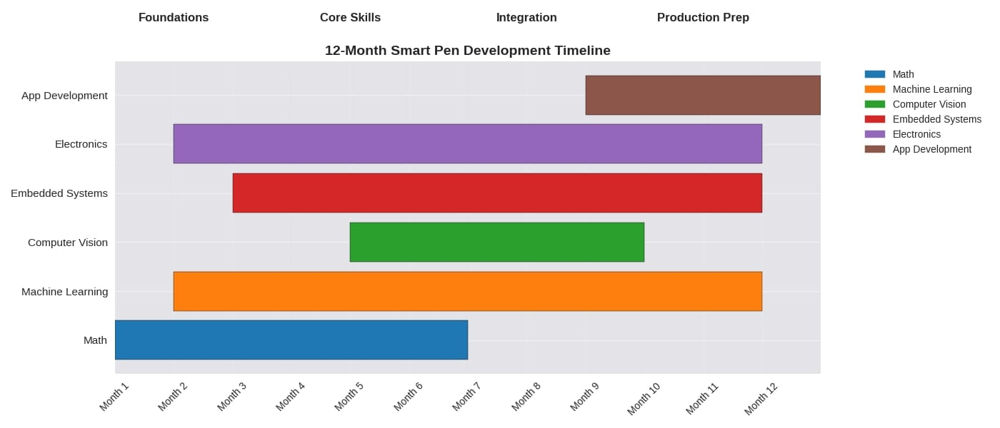

| Month | Focus | Milestones / Mini‑Projects | Recommended Free Resources |
|-------|-------|-----------------------------|-----------------------------|
| 1 | Algebra → Pre‑Linear Algebra, Python practice, electronics basics | Blink LED with microcontroller | Khan Academy Algebra, Think Python (free PDF), Arduino Project Hub |
| 2 | Linear algebra basics, intro ML concepts, IMU sensors | Capture IMU motion data + visualize in Python | Linear Algebra Done Right (free notes), scikit‑learn tutorials, GitHub: IMU-data-logger |
| 3 | Pre‑calculus, regression/classification, embedded C basics | Classify simple pen movements with IMU | Khan Academy Pre‑calculus, Dive Into Systems (free PDF), GitHub: Arduino-IMU |
| 4 | Calculus I, computer vision basics, camera modules | Capture/process images from camera module | MIT OCW Calculus I, OpenCV-Python tutorials, GitHub: opencv-handwriting |
| 5 | Calculus II, neural networks basics, embedded systems | Train NN on MNIST digits | MIT OCW Calculus II, Neural Networks and Deep Learning (Michael Nielsen, free online book), TensorFlow tutorials |
| 6 | Review math, handwriting stroke segmentation, IR LED + camera integration | Detect pen strokes on paper | CS231n lecture notes, OpenCV docs, GitHub: handwriting-segmentation |
| 7 | CNNs, embedded optimization, battery management | Prototype pen body with IMU + camera + battery | Stanford CS231n, ARM Cortex-M4 dev docs, GitHub: tiny-cnn |
| 8 | RNNs for sequence data, dataset collection/labeling, Bluetooth integration | Stream pen data to laptop/phone | Deep Learning with PyTorch (free PDF), GitHub: handwriting-rnn |
| 9 | Combine CNN + RNN, app interface basics, PCB design | First end‑to‑end demo (pen → app → text) | Made With ML tutorials, KiCad EDA (free PCB design tool), GitHub: smart-pen-prototype |
| 10 | Model optimization (quantization, pruning), app UX, power efficiency | Pen works offline + syncs later | TensorFlow Lite docs, GitHub: model-compression |
| 11 | Error analysis, export features, casing design | Polished prototype with stable firmware + app | Pattern Recognition and Machine Learning (Bishop, free PDF online), FreeCAD tutorials, GitHub: note-taking-apps |
| 12 | Integration testing, documentation, demo | Working smart pen + notebook prototype | The Art of Electronics (Horowitz & Hill, free PDF), GitHub: electronics-prototypes |[^1]

[1]: [[Session plan]]
[^2]: [[Gnatt Timeline + code]]
[^3]: [[README]]
[^4]: [[Skills Needed]]

